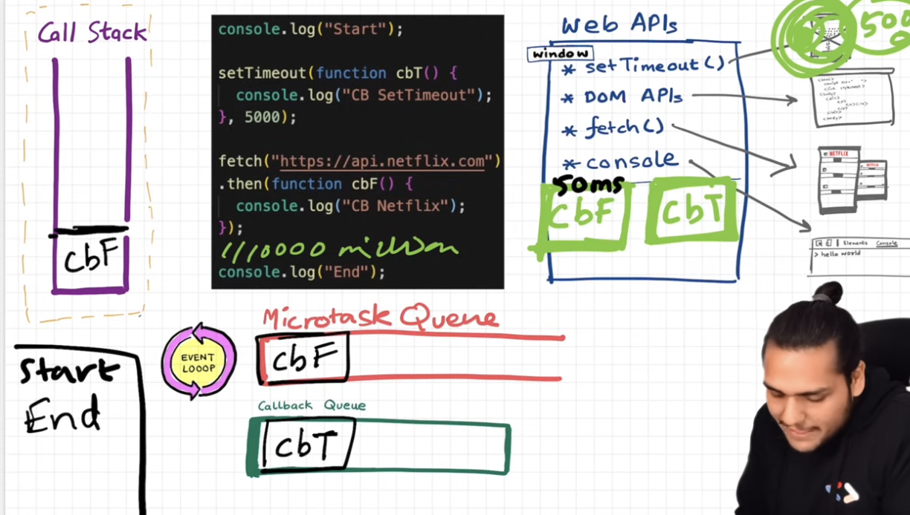

# Namaste Javascript

## Ep-01 : How Javascript Works

**Execution Context** : Everything in JS works inside the execution context. It looks like:

| Variable Environment(Memory)   |       Thread of Execution(Code) |
| :----------------------------- | ------------------------------: |
| Stores variables and functions | Executes the code synchronously |
| Key : Value                    |                            Code |
| a = 10                         |                            Code |
| fn{}                           |                            Code |

- ### **Javascript is a synchronous single-threaded language**

## Ep-02 : How JS Code is executed?

take example:

```javascript
1 var n = 2;
2 function square(num){
3     var ans = num*num;
4     return ans;
5 }
6 var square2 = square(n);
7 var square4 = square(4);
```

- **Global Execution Context** (GEC) is created with Memory and Code component
- In phase 1: **Memory Creation phase**

  - Memory is allocated to all the variables and functions
  - For variables: undefined
  - For functions: code (copies the whole code in variable env)
  - n: undefined
  - square: {...code}
  - square2: undefined
  - square4: undefined

- In phase 2: **Code Execution phase**
  - All code is executed line-by-line and performs all calculations and functions
  - Line 1, Places the actual value of n in the memory
  - Skips the function code from line 2-5
  - At line 6, it reads the square fn, and can't assign a value to it directly, like other vars

| Variable Environment(Memory) |       Thread of Execution(Code) |
| :--------------------------- | ------------------------------: |
| n: undefined                 | Executes the code synchronously |
| square: {... code}           |    Execution Context for square |
| square2: undefined           |                            Code |
| square4: undefined           |                            Code |

- Inside the Execution context created for square function in Code component:
  - Jump to line 2
  - It creates a new exceution context for that invoked function in the thread of execution and it will have its own variable memeory and thread of execution
  - Inside new execution context memory component, ans and num variables are added
  - Value of num inside EC-2 will be **passed from GEC**, i.e. num = 2
  - In its code component, it will calculate value for ans by **ans=num\*num** and assign it to ans, replacing undefined
  - At line 4, it sees return
  - Return means return the control back to the execution context from where the function was invoked
  - So it returns the control to line 6 (where fn was invoked)
  - Having **ans = 4** it will replace the undefined for square2 in EC-1
  - Now it has returned the control to the original function invokation code line, EC-2 will be removed from the EC-1
  - At line 7, it wil again create a new exceution context for square fn.
- Eventually, after whole program is run, the global execution context is also deleted

### Call Stack:

- At the bottom, it has the Global Execution Context, on top of which the other EC are created and pushed to stack
- _It maintains the order of execution of execution contexts_

## Ep-03 : Hoisting

Even before the code starts executing, memory is allocated to all the vars and fns

- This is why JS won't throw an error even if I try to use a var before it is being declared in the code
- For a function, it simply returns the function code for arrow functions and function value for other functions

## Ep-04 : Functions

Functions are added in the CS on the top of GEC after they are invoked.

- Each function has its own execution context and memory + code component. \
  So even using same variable names in a function scope and in global scope won't throw an error because its scope will be limited to its EC and will finish as the control returns back to where the fun was invoked after the fun is completely executed.
- After executing, for a function, its:
  - EC is deleted,
  - memory is freed,
  - erased from CS

## Ep-05 : Shortest JS Program

An empty js file can act as the shortest JS program. \
Even without any line of code -

- It creates the GEC and sets up the memory space as well.
- It creates a window object and a this pointer to it everytime.
- When a JS environment starts running:
  - It sets up the runtime (JS engine + environment features)
  - In Browser, it is:
    - V8 JavaScript engine (Chrome)
    - DOM + Web APIs (provided by browser)
  - The global object is created first and it becomes accessible everywhere
  - It stores global APIs, functions, and environment features
  - Then JS engine executes our script inside this global context.

### **var** vs **const / let**

---

| var                                         | const/let                                                                                                                      |
| ------------------------------------------- | ------------------------------------------------------------------------------------------------------------------------------ |
| var is older                                | const/let introduced in ES6                                                                                                    |
| polluted the global namespace               | not hoisted in same messy way and not polluting global object                                                                  |
| mistakenly shows up in global window object | stored inside Declarative Environment Record                                                                                   |
| **function-scoped**, not block-scoped       | block-scoped live in lexical environment                                                                                       |
| automatically attached to the global object | create global variables, but not global properties - Means they ARE accessible everywhere but they DO NOT appear inside window |
| hoisted and accessible anywhere             | hoisted, but can't be used before initializing the value                                                                       |

## Ep-06 : undefined vs not defined

---

- undefined is a special keyword acts like a placeholder
- used to say - This variable exists, but no value has been assigned to it
- represents absence of a value
- undefined doesn't mean empty - it takes up its own memory
- needed because :
  - placeholder for variables that don't have a value yet
  - functions in JS must return something, if it is not, undefined is used
    ```javascript
    function foo() {}
    foo(); // returns undefined
    ```
- avoid assigning undefined to a variable because won't be able to differentiate whether the value of that var never existed, or was it explicitly assigned as undefined
- it is a global property that cannot be overwritten

- not defined just means the var was never declared/created, but are trying to access it

## Ep-07 : Lexical environment and scope chain

**Lexical env** : Local memory + lexical env of parent

- In each function memory space, a reference to lexical en of parent also exists
- A function can have access to its own local memory and the lexical env of its parent (and consequently parent of parent)

**Scope Chain** : Chain of all lexical environments in hierarchical order

## Ep-08 : _let_ & _const_ and Temporal Dead Zone

**Temporal Dead Zone**:

- The period between when a variable is declared (in memory), and when its initialized with value
- This prevents bugs caused by accidentally using variables before they are ready
- Trying to access a variable inside TDZ gives _ReferenceError_

  ```javascript
  console.log(a);
  let a = 2;
  ```

- Till the time control doesn't reach line 2, "a" is present in the memory, but is not initialized, hence it is in TDZ.

let and const :

- Not attached to window object
- Hoisted, but not accessible unless initialized
- present in TDZ meanwhile till initialization
- let can be initialized and declred separately
- const is more strict than let in the sense that it has to be initialized as soon as it is declared
- var can be declared/initialized anywhere
- var is function-scoped, can't access a var declared inside a function, outside its scope

| ReferenceError                                               | SyntaxError                                                         | TypeError                               |
| ------------------------------------------------------------ | ------------------------------------------------------------------- | --------------------------------------- |
| Trying to find a value which is not present in current scope | Redeclaration of let or const variables or not initializing a const | Assigning value to const variable again |

## Ep-09 : Block Scope & Shadowing

**Block** is used where we want to group multiple statements in JS. \
**Block Scope** defines what variables and functions can be accessed inside that block.

- _let_ & _const_ are block-scoped - Can't be accessed outside the block
- _var_ is in global scope

**Scopes** -

- Global : _var_ exists here
- Block : _let_ and _const_
- Script : _global let_ and _const_ (outside the block and outside all functions)
- Function : var is function scoped. variables inside function execution context

**Shadowing** -

- var with same name inside and outside a block are overwritten by the one that comes later, as they are in global scope
- let and const are shadowed but they retain their value in global scope, and have the block value in block scope.

**Illegal Shadowing** -

- let can't be shadowed using var
- let can be shadowed using let
- but var can be shadowed by let - because it doesn't cross the function scope or boundary

## Ep-10 : Closures

**Closure** : function + its lexical environment

- When a function returns an inner function
- Closure is created when inner function remembers variables from its outer function even after outer one has finished executing
- A function forms a closure with the scope where it is declared,
  not with the scope where it is invoked.
- Uses of closures:
  - async programming
  - callbacks
  - event handlers
  - private variables
  - React hooks
  - currying
  - memoization
  - functional programming
  - Module design pattern
  - functions like once
  - setTimeouts
  - Iterators

## Ep-11 : Closures

## Ep-12 : Closures

#### setTimeout

---

An interesting thing about setTimeout - it may not always take the same time as we want it to, depending on the CS.

- If the CS is blocked by millions of lines of code, that need 10s to execute, and the timeout had 5s timer.
- Then, timeout callback fn can execute only after the CS becomes empty, be it 3s, 10s or 5s.
- So, we were expecting it after 5s, but it will execute after CS is empty after 10s.
- _Even if the timer is set to only 0s, still it will firstly go through callback queue, and then be executed after everything in CS has finished executing._

## Ep-13 : First Class and Anonymous functions

#### **Function Statement or Declaration**

Creating a function in this way is a function statement

```javascript
function a() {
	console.log("This is fun statement");
}
//can be hoisted
a();
```

#### **Function Expression**

Assigning a function to a variable, where the function acts like a value

```javascript
var b = function () {
	console.log("Function Expression");
};
//hoisting will throw an error
b();
```

| Function Statement                 | Function Expression                                                                                |
| ---------------------------------- | -------------------------------------------------------------------------------------------------- |
| Normal function with a name        | Assigning a function to a variable                                                                 |
| fun a() {}                         | var b = fun(){}                                                                                    |
| Called by a();                     | Called by b();                                                                                     |
| Hoisting supported                 | Hoisting throws error                                                                              |
| fun code is stored in memory of EC | only var value is stored as undefined in memory of EC                                              |
| Hoisting will work expectedly      | Hoisting like b(); will say typeError (doesn't know b stores a function bcoz b is undefined still) |

#### **Anonymous Function**

- Functions without a name
- Can be created when functions are to be used as values assigned to variables

```javascript
var a = function () {
	console.log("Anonymous");
};
```

#### **Named Function Expression**

When named function is assigned to variable

```javascript
var a = function b() {
	console.log("named function expression");
};
```

- variable 'a' can be called like this: `a();`
- function 'b' cannot be called like : `b();`
- because its not present in memory of EC, will throw ReferenceError

#### **First Class Functions**

- Ability of functions to be used like values
- (either to pass to another function or to be returned from another function)
- Also called **First Class Citizens**
- Passing functions inside other functions as arguments

  ```javascript
  var b = function (fcf) {
  	//passing fn as parameter to another fn b
  	console.log(fcf);
  };

  function xyz() {
  	//FCF
  	console.log("First Class Function");
  }

  b(xyz); //Calling a fn with fn as argument
  ```

- We can also return a function from a fn

  ```javascript
  var b = function (param) {
  	return function xyz() {};
  };
  console.log(b());
  ```

## Ep-14 : Callback Functions

- JS is a synchronous single-threaded language
- Passing a function to another function -> passed fn is callback fn

  ```javascript
  setTimeout(function () {
  	console.log("timer");
  }, 3000);

  function x(a) {
  	console.log("x");
  	a();
  }

  x(function y() {
  	console.log("y");
  }); //pass y inside x
  ```

- setTimeout is registered
- stored at a separate place, with a timer of 3s attached to it
- Meanwhile, program will remain executing
- x is called
- Prints:
  - x
  - y
  - timer (after 3s)

_Blocking the main thread_ - Any operation blocking the CS \
To avoid it, use async operations (like setTimeout) for heavy, time taking tasks

In the example, it gets out of the CS and then after the timer expires, it appears again in the CS and resumes program

#### Event Listeners

- Event listeners can also invoke closures with scope.
- Event listeners consume a lot of memory which can potentially slow down the website therefore it is good practice to remove if it is not used.
- Garbage Collection - need to remove event listeners as they form a lot of closures with the variables in kexical scope, and thus making it heavy

## Ep-15 : Event Loop and Callback Queue

1. Firstly, a **Global Execution Context (GEC)** is created.
2. The GEC is pushed into the **Call Stack**.
3. The code runs line-by-line inside the GEC.
4. A new **Execution Context** is created when a function is **invoked**.
5. The function’s Execution Context a() EC is **pushed into the Call Stack**.
6. The function’s code executes **line-by-line inside its own EC**.
7. Data is printed to the console (if any).
8. The function finishes executing (reaches the end of the function).
9. The function’s Execution Context is **popped out of the Call Stack**.
10. The remaining global code (after the function call) **resumes execution**.
11. The last line of the global code executes.
12. The **GEC is popped out of call stack**

---

Call Stack executes whatever is pushed to it **immediately** - doesn't wait for anything.

_But what if we need to wait for something??_

Not possible - CS executes everything immediately - no waiting (it doesn't have a timer)

#### Browser - Superpowers

- Browser -> JS Engine -> Call Stack

Browser contains -

- Console
- Timer (setTimeout)
- Local Storage
- JS Engine
- url
- fetch - communication to servers
- DOM APIs - like addEventListeners
- UI
- Promise handling
- MutationObserver
- Bluetooth
- Geolocation
- File system access in Node.js
- etc ...

**Web APIs**: These come from the browser, **not** a part of JS. Browser gives access to these inside the JS engine so we can use them. \
These all can be accessed using the **global object (window)**

- console
- setTimeout()
- fetch()
- localStorage
- DOM APIs
- location


```javascript
console.log("Start");

setTimeout(function cb() {
	console.log("callback");
}, 5000);

console.log("End");
```

1. actually calls the Web API of console which in turn makes a call to log something inside the actual console, thus enables the JS engine to print 'Start' on console.
2. calls web API of setTimeout giving access to timer feature of browser
3. registers a callback
4. starts the timer of 5000ms
5. code resumes from next line, doesn't wait for anything
6. 'End' is printed on console.
7. code execution ends, while timer is still runnning.
8. GEC popped out of stack
9. Now to execute the callback function code, it needs to be inside the CS first somehow -

#### Event Loop and Callback Queue

10. When _timer expires_, the callback function moves into the **callback queue**
11. **Event Loop** checks the callback queue and puts the function inside it into the CS
12. CS then quickly executes the received callback function

- creates EC of callback fn
- prints 'callback' into console


**AddEventListeners** : registers a callback and attaches the event to it

The whole GEC and code execution part remains the same, they don't wait for anything. \
But in case of **event listener**s, when the **callback is registered**, it also **attaches the event with it** ('click' in this case). \
Then remaining code executes. \
But event handler callback fn sits there until its explicitly removed or browser is closed. (because it can be clicked anytime - so cannot be removed until the end) \
When click event occurs, **callback fn is pushed to the callback queue**. \
**Event loop repeatedly checks** if something is present in the CBQ, and if CS is empty. \
As soon as CS is empty, and CBQ has something to be executed, it pushes that fn into CS \

_Q. Why is Callback Queue required? Why can't the event loop directly push the fn into CS as soon as it sees them?_

- In case of multiple callbacks, they need to be queued and execeuted one by one (like clicking button 5-6 times repeatedly) -> all need to be executed one by one, and each is popped of the CBQ.

#### fetch



#### Microtask Queue (Promise Queue) - MTQ

Higher priority callbacks from:

- Promises (.then, .catch, .finally) from network calls like fetch
- async/await
- MutationObserver (checks for mutation in the DOM tree)

Till all the tasks in Microtask queue are not executed, the event loop doesn't add any task from CBQ to CS

#### Callback Queue - CBQ

Lower priority callback tasks:

- setTimeout
- setInterval
- DOM events (like "click")
- other callbacks
  After all MTQ tass are over, it adds callback events to CS one by one

#### Event loop

Repeatedly checks - callback queue, microtask queue and CS. \

If CS is empty:

- first check MTQ (higher in priority)
- if it contains a fn, then remove it from queue and push it to CS
- execute it
- check for next task in that queue

If MTQ is empty:

- check callback queue (lower priority)
- execute all fns one by one by adding to CS

_Priority_: GEC (main code execution) -> Microtask Queue callbacks execution -> Callback Queue callbacks execution

## Ep-16 : JS Engine

JS can run inside - browser, server, smartwatch, robots, light bulb, IoT devices, etc. because of the JS Runtime Environment

JS Runtime Environment has:

- JS Engine
- Callback Queue
- Microtask Queue
- Event loop
- API
- Global object (window in browser, global in node)
- Memory Management

Javascript Runtime Environment can be understood as a container that has everything required to run the JS code and let JS interact with the outside world.

There are two major runtime env: Browser and NodeJS which contain some similar/common and some different APIs.

---

### Inside the JS Engine

Takes human-readable code as input which undergoes 3 steps:

- Parsing - Code is broken into tokens and is parsed
- Compilation -
- Execution -


#### **Parsing**

- Break the code into tokens
- **Syntax parser** - convert the code to AST ([Abstract Syntax Tree](https://astexplorer.net/))

#### **Compilation**

Q. What is interpreter and compiler?

**Interpreter** executes the code line-by-line, without knowing about the next line

**Compiler** compiles the whole code before executing anything. It forms a compiled and optimized version of the code

| Feature              | Interpreter                                | Compiler                                          |
| -------------------- | ------------------------------------------ | ------------------------------------------------- |
| **Execution Method** | Executes code **line-by-line**             | Translates **entire program** before running      |
| **Output**           | No intermediate output; runs directly      | Produces compiled **machine code / bytecode**     |
| **Execution Speed**  | Slower (work is repeated at runtime)       | Faster (fully optimized before running)           |
| **Startup Time**     | Very fast but less efficient               | Slower (needs compilation first) - More efficient |
| **Error Detection**  | Errors appear **during runtime**           | Errors appear **before execution**                |
| **Memory Usage**     | Often higher                               | Usually lower after compilation                   |
| **Use Case**         | Good for scripting, quick testing          | Good for large, performance-critical apps         |
| **Examples**         | JavaScript (originally), Python, PHP, Ruby | C, C++, Rust, Go, Java (JVM bytecode)             |

|

### JIT Compilation

JS uses both interpreter and compiler to exceute the code.

Parsing -> reads code and generates the AST \
Interpreter -> generates bytecode from high-level code and executes it \
Compiler -> optimizes the code on runtime

Step-wise JIT Compilation:

1. _Parser_ : reads code and generates tokens and creates the AST
2. _Interpreter_ (Ignition) : generates bytecode from high-level code and executes it

- **Ignition** is the name of interpreter used by V8 engine
- Provides _fast_ startup
- Takes the _AST_ and produces its _bytecode_ which is fast and lightweight
- Reads that code line-by-line and exceutes it immediately

3. _Compiler_ : Performs optimizations on bytecode

- **Turbofan** is the name of compiler used by V8 engine
- Optimization done in phases.
- If a function is executed many times - Turbofan says: “This code is hot — let’s optimize it.”
- It converts bytecode to highly optimized machine code which is much faster and eliminates unnecessary operations
- Why is it done in phases?
  - Full compilation is slow
  - Many functions run only once
  - Not worth optimizing everything

#### Execution

Requires the Memory Heap and Call Stack

- **Memory Heap** - where all variables and functions are assigned memory. It stores:
  - objects,
  - arrays,
  - functions,
  - closures,
  - reference types
- **Call Stack** - It stores:
  - function calls
  - execution contexts
  - local variables
  - scopes
- **Garbage Collector** - JavaScript automatically frees memory that is no longer needed.

#### **_Mark-and-sweep algorithm_**

---

GC works like:

- **Mark** objects that are still reachable, i.e., can still be accessed. GC starts from root objects: global object (window / global) -> local variables on stack -> closures. \

  - It traverses the object graph and marks reachable objects -> “live”.

  - Objects not reached → “garbage”.

- **Sweep** (delete) objects that are not reachable anymore. Frees memory of unmarked objects and keeps marked ones.

After function finishes:

- Marked object is no longer reachable.
- GC deletes the object from heap.

### Optimizing techniques Concepts :

---

**Inlining**: It is an optimization where the JS engine replaces a function call with the actual body of the function.

_Why_?

- Function calls are expensive (stack ops, context creation).
- If a function is small & predictable, it’s cheaper to paste its body inline.

  ```javascript
  //BEFORE INLINING
  function add(a, b) { return a + b; }
  let x = add(2, 3);
  -----------------------
  //AFTER INLINING
  let x = 2 + 3;
  ```

_When the engine inlines_:

- Function is small
- Parameters are predictable types
- Execution pattern is stable

_When it avoids inlining_:

- Mega functions
- Function used with unpredictable types
- Deep recursion

---

**Copy Elision** : Copy Elision is an optimization where unnecessary intermediate objects or values are not created at all — the engine allocates the final object directly.

_Why?_

- Creating short-lived objects is expensive.
- JS engines try to skip useless intermediate allocations.

  ```javascript
  function getPoint() {
  	return { x: 10, y: 20 };
  }
  ```

A naive implementation:

1. Creates {x:10,y:20}
2. Copies it to the return slot

Optimized implementation:

1. Directly creates the object in the return location
   → no extra temporary object is created

Copy elision happens during:

- Return statements
- Array spreads
- Object spreads

---

**Inline Caching (IC)** : Inline caching is a JIT optimization where the engine remembers the type/shape of objects to speed up property access.

_Why ?_ \
JS objects are **dynamic**: properties can appear, disappear, or change types. \
Accessing properties is slow if the engine has to lookup every time. \
-> **_IC solves this._**

_How it works ?_

Consider:

```javascript
function printUser(u) {
	console.log(u.name);
}
```

If called repeatedly with similar objects:

```javascript
printUser({ name: "A" });
printUser({ name: "B" });
```

- V8 notices u always has the same shape (same properties).
- It “caches” where .name property lives in memory.
- Next time, it directly jumps to that memory location.

_Effects:_

- 20x faster property access.
- Predictability = optimization.

_Types of IC:_

1. Monomorphic → Same shape always (fastest!)
2. Polymorphic → Few shapes
3. Megamorphic → Too many shapes → deoptimized

Google's V8 engine has Garbage Collector - **_Orinoco_**, for JS garbage colection and **_Oilpan_** for DOM and browser objects.

- Chrome JS Engine - **V8**
- Chrome rendering engine - **Blink**
- GC for Blink (DOM & Browser objects) - **Oilpan**
- GC for V8 with modern architecture - **Orinoco**

## V8 GC vs Orinoco vs Oilpan — Comparison

| Feature                      | V8 GC                                                                | Orinoco                                                       | Oilpan                                                    |
| ---------------------------- | -------------------------------------------------------------------- | ------------------------------------------------------------- | --------------------------------------------------------- |
| **What it is**               | The entire garbage collection system inside the V8 JavaScript engine | The _modern GC architecture_ inside V8                        | Garbage collector for DOM + Blink objects                 |
| **Manages memory for**       | JavaScript objects                                                   | JavaScript objects (young + old gen)                          | DOM nodes, CSS objects, Blink engine structures           |
| **Part of**                  | V8 engine                                                            | V8 engine                                                     | Blink rendering engine                                    |
| **Replaces**                 | Older generational GC systems                                        | Replaces older V8 GC implementation                           | Replaces manual memory management & ref-counting in Blink |
| **GC Type**                  | Generational, mark-sweep, mark-compact                               | Concurrent + incremental + parallel GC                        | Tracing GC integrated with V8 (Unified Heap)              |
| **Concurrency**              | Older versions mostly stop-the-world                                 | Highly concurrent & low-latency                               | Works with V8 concurrently                                |
| **Handles JS ↔ DOM cycles?** | No                                                                   | No                                                            | Yes (Unified heap solves cycles)                          |
| **Optimized for**            | Speed of JS execution                                                | Low-latency GC for JS                                         | Automatic cleanup of DOM and browser-side objects         |
| **Main Components**          | New space GC + old space GC                                          | Concurrent marking, parallel sweeping, incremental compaction | Blink heap, conservative stack scanning                   |
| **Goal**                     | Run JS fast                                                          | Low-latency, high-performance memory management               | Prevent memory leaks in DOM, unify JS & DOM GC            |

## Ep-18 : Higher Order Functions

A function which takes another function as an _argument_ or _returns_ a function from it is HOF. \
JavaScript treats functions as first-class citizens, meaning:

- You can store a function in a variable
- Pass a function as an argument
- Return a function
- Put a function inside objects/arrays
- Use them just like data

HOF examples: \

- Array methods

  - map()
  - filter()
  - reduce()
  - forEach()
  - find()

- Promise functions

  - then()
  - catch()
  - finally()

- Timing functions

  - setTimeout(callback, time)
  - setInterval(callback, time)

- DOM event listeners
  - button.addEventListener("click", handler)

---

---

---

## Ep-01 : Callback Hell

Callbacks are useful when we want to perform some extra functionality with our already existing function for example passing an error handling callback to our already created function,
The two Problems with callbacks

1. **Callback Hell**: When callbacks within themselves start taking in other functions as callbacks then that mess that you are left with is known as the Callback Hell. \
   It leads to unreadable code, hence unmaintanable and hard to test and debug. \
   It happens due to asynchronous operations that depend on each other. \
   This callback inside callback is called _Pyramid of Doom_.

2. **Inversion Of Control**: When we pass a function to other function as a callback we are giving the called function the control of whether to even call it or not or maybe call it in a wrong context. For example a success callback is called when an error occours inside a called function (maybe due to human error while writing the code for called function), this type of giving up of control over our functions is known as inversion of control.

You hand over a callback to someone else (a library, API, event loop)
and hope it executes correctly. If the library is buggy, your code fails.

Problems with handing over:

- You can’t control when it runs
- You can’t control if it runs
- You can’t control how many times it runs
- You can’t enforce error handling
- You can’t prevent multiple callback calls

## Ep-02 : Promises

```javascript
createOrder(cart, function (orderId) {
	proceedToPayment(orderId);
});
```

**_Inversion of Control_** \
 is present. We expect createOrder function to call our proceedToPaymnet automatically, and thus losing control over `proceedToPayment(orderId)`.

Solution: **Promise**

- Instead of giving the control of our function to some other code, we can make it return a promise in place of taking the callback function.
- `createOrder` is async operation. It can take any amount of time to execute, but we try to ensure whenever it completes, it returns us an object with some value.
- This value can be initially undefined. But then, after 5s, when the function is complete, it will fill the value in object automatically with the returned value from async op.
- Then we can attach a callback function to this promise object. So, when the data is filled with value, .then callback function will be called.
  _fetch() function returns a promise_

### <mark>_Promise object represents eventual completion (or failure) of an asynchronous operation and its resulting value._</mark>

#### Promise structure

- Promise State:
  - Pending - initial state
  - Fulfilled - operation completed successfully
  - Rejected - operation failed
- Promise Result: The value returned by async operation


#### -> _Promise objects are immutable_

### Promise chaining

Attach `.then()` after a promise which will automatically call the next function after the promise is completed(resolved or rejected).

<mark>_Return value from a promise while doing promise chaining_</mark>:


## Ep-03 Creating Promise

A promise gets resolved or rejected based on success/failure of async operation.

- It will be resolved exactly once or gets rejected. So, the uncertainity of callbacks is removed.

Create promise using `Promise()` constructor that takes a callback function which has 2 args: resolve & reject. \
Write logic for both - resolve and reject inside promise.


```javascript
const promise = createOrder(cart);

promise
	.then(function (orderId) {
		console.log(orderId);
	})
	.catch(function (err) {
		console.log(err.message);
	});

function createOrder(cart) {
	const val = new Promise(function (resolve, reject) {
		if (false) {
			const err = new Error("Some error");
			reject(err);
		}
		const orderId = "12345";
		if (orderId) {
			setTimeout(function () {
				resolve(orderId);
			}, 3000);
		}
	});
}
```

**Promise chaining:**

```javascript
createOrder(cart)
	.then(function (orderId) {
		console.log(orderId);
		//VERY IMPORTANT IN CHAINING: Return the data for next promise
		return orderId;
	})
	.catch(function (err) {
		console.log("Cart is not valid"); //Catches all errors on top of this
		//.then() below this will still work
	})
	.then(function (orderId) {
		return proceedToPayment(orderId);
	})
	.then(function (paymentInfo) {
		console.log(paymentInfo);
	})
	.catch(function (err) {
		console.log(err.message); //Catch block handles all errors on top of this.
	});

//IF YOU NEED TO PROCEED WITH THE PROMISES EVEN IF Catch block catches an error, USE catch() multiple times, and the '.then()' after the .catch() will still execute.
```

## Ep-04 Promise APIs

INPUT: Takes an _Iterable_ (like array/map/string/etc.)

1. **Promise.all()** - Fail Fast

OUTPUT: Array of promise values (success) / Error if any promise rejected

- _All success_ - Returns array of resolved values after the last promise is resolved
- _Any Error_ - Returns error (not array) as soon as any error is seen, not wait for other promises to settle

2. **Promise.allSettled()**

OUTPUT: Object -> Array of promise values (error or success) returned after all the promises are settled.

- _All success_ - Returns array of promise values (success) after the last promise is resolved
- _Any Error_ - Waits for all promises to settle, then returns array of resolved values or rejected errors in same order as input of promises

3. **Promise.race()**

OUTPUT: Returns result of first settled promise (error or success)

- _First success_ - Returns resolved value of first settled promise
- _First Error_ - Returns Error of first settled promise

4. **Promise.any()** - First Success Seeker

OUTPUT: Returns result of first successfully resolved promise / AggregateError if all fail

- _First success_ - Returns resolved value of first settled promise
- _First Error_ - Waits for a promise to be successful (ignores rejected promises)
- _All Error_ - AggregateError (Array of all errors in correct order)

## Ep-05 Async Await

Async function <mark>always returns a promise.</mark>

- If I provide return value as promise, it returns that as is.
- If I don't provide a promise, then it wraps the return value in a promise and then returns it.

Await **always used in front of a promise and inside an async function.**

_Why async await?_

- promise: JS engine doesn't wait for the promise to get resolved, it directly starts executing the next line.
- async await: JS Engine will wait at the line where promise is being returned, and only after getting a value will it move to the next line.

PROMISE

```javascript
const p = new Promise((resolve, reject) => {
	setTimeout(() => {
		resolve("Promise resolved!");
	}, 5000);
});

function handlePromise() {
	p.then((res) => {
		console.log(res);
	});
	console.log("Doesn't wait for promise to be resolved, logged instantly");
	console.log("res will be printed after this as it takes time to be resolved");
}

handlePromise();
```

- JS Engine will not wait for promise to be resolved
- instead directly prints the console logs
- after promise resolved, res is printed

ASYNC AWAIT

```javascript
async function handlePromise() {
	console.log("Logged instantly");
	const val = await p;
	console.log("After p resolved");
	console.log(val);

	const val2 = await p;
	console.log("Promise resolved already won't wait ");
	console.log(val2);
}

handlePromise();
```

- JS Engine will wait for promise to be resolved
- after promise resolved, prints the console logs and res value in order
- if promise called multiple times, it is resolved only once and uses the value from the first resolution

### async await examples:

```javascript
1  const p1 = new Promise((resolve, reject) => {
2    setTimeout(() => {
3      resolve("Promise 1 resolved!");
4    }, 10000);
5  });
6
7  const p2 = new Promise((resolve, reject) => {
8    setTimeout(() => {
9      resolve("Promise 2 resolved!");
10    }, 5000);
11  });
12
13 async function handlePromise(){
14   console.log("Logged instantly");
15   const val1 = await p1;
16   console.log("Promise 1");
17   console.log(val1);
18
19   const val2 = await p2;
20   console.log("Promise 2");
21   console.log(val2);
22 }
23
24 handlePromise();

```

- p1 takes 10 seconds, p2 takes 5 seconds
- handlePromise goes in CS
- it scans for all vars and async functions
- they are being resolved in the background
- 14: `Logged instantly` is printed immediately
- 15: p1 value not yet present
- handePromise exits the CS freeing the space for remaining execution
- javascript engine only appears to be waiting for the promise to be resolved, NOT WAITING actually.
- instead the thread of execution is not blocked, and handlePromise is out of CS.
- after 10 seconds, 15: has its value, handlePromise enters CS again
- logs the line 16 and 17
- 19: has p2, which is already resolved(in 5 seconds)
- logs the line 20 and 21 also together with 16 and 17.


- p1 takes 5 seconds, p2 takes 10 seconds
- handlePromise in CS
- logs line 14
- handlePromise is suspended, exits CS
- p1 resolved in 5, 
- handlePromise again enters CS
- logs line 16 and 17
- handlePromise exits CS
- Remaining functions in JS main thread execute
- after 10 seconds, p2 is resolved
- handlePromise again enters CS
- logs line 20 and 21
- handlePromise exits CS

---
<mark> Q. *How fetch works?* </mark>
- Fetch function itself is a **promise** that returns a *response object*. 
- This Response Object has a body which is a *readable stream*. 
- To get the required data from it in json format, we need to do ```.json()```; 
- .json() is a promise which gives JSON value when resolved. 

#### Error Handling:

Using **try catch** : 
```javascript
try{
  handlePromise();
} 
catch(error){
  console.error(error);
}
```
Or using catch block after the promise call: ```handlePromise.catch(error);```

